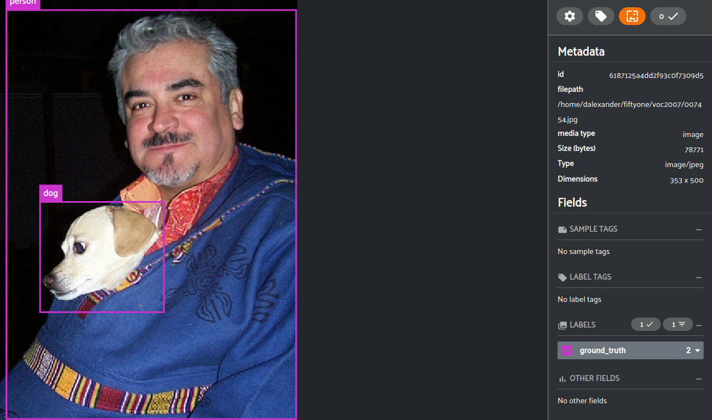

# Using CNN with Object Detection to locate and Identify object classes

---

## Prerequisites:
- [Tensorflow](https://www.tensorflow.org/install) must be installed in your virtual environment
- [Object Detection API](README.md#object-detection-api-install/)
- [Fiftyone](https://voxel51.com/docs/fiftyone/index.html) used for visualization of our dataset
- [The PASCAL Visual Object Classes Dataset](http://host.robots.ox.ac.uk/pascal/VOC/index.html):
    -  Provides standardised image data sets for object class recognition
    - Provides a common set of tools for accessing the data sets and annotations
    - Enables evaluation and comparison of different methods  
    - The VOC challenge encourages two types of participation: (i) methods which are trained using only the provided "trainval" (training + validation) data; (ii) methods built or trained using any data except the provided test data, for example commercial systems. In both cases the test data must be used strictly for reporting of results alone - it must not be used in any way to train or tune systems, for example by runing multiple parameter choices and reporting the best results obtained. 
    - This is automatically downloaded within the tutorials, but you can download it separately if you like to play around some more when we are done.
    - Memory Requirements: 10GB (Not including Tensorflow)
---
## A Convolutional Neural Network (CNN)
A convolutional neural network (CNN) is a type of artificial neural network used in image recognition and processing that is specifically designed to process pixel data. A neural network is a system of hardware and/or software patterned after the operation of neurons in the human brain. Traditional neural networks are not ideal for image processing and must be fed images in reduced-resolution pieces. 

We will CNN image recognition and implement Object Detection using our pre-defined classes.

- Here is a list of the `VOC2007` classes used to train and model our dataset:

    ```text
    aeroplane
    bicycle
    bird
    boat
    bottle
    bus
    car
    cat
    chair
    cow
    diningtable
    dog
    horse
    motorbike
    person
    pottedplant
    sheep
    sofa
    train
    tvmonitor
    ```

- Our class becomes the labels for our object. Below is a graph showing the number of object classes identified from our model, we call this our `ground truth`.

    

- Lets take a simple Image and apply our model classes to identify the objects in the photo. We will use the `object-detection api` to location the `dog and person` since they are the two defined classes above that we can identify in the image.


    


- After we apply `object-detection api` to our model and visualize our dataset using `fiftyone` we will see.

    


- The same goes for our other classes used to train our model.

    

- Here is how `fiftyone` visualizes our images and classes.

    

---

## 1. Download and Prepare the dataset

Tensorflow provides us with `tensorflow_dataset.load` to load our dataset from the Google Cloud DataLake.  This provides a rich collection of datasets for use.  In this project:
- download the `VOC2007` dataset, 
    ```python
    def get_dataset(dataset_name,dataset_directory,batch_size):
    """
    Checks for and creates the dataset directory if it does
    not exist.
    :param dataset_name: the dataset name, i.e. 'voc'
    :param dataset_directory: the dataset directory
    :param batch_size: the number of training examples utilized in one iteration.
    :return: tuple[dict | list | tuple | Any, DatasetInfo] | dict | list | tuple | Any
    """
    # Create the dataset directory and download dataset
    data_path = get_dataset_dir(dataset_directory)
    ## Create dataset directory if not exist
    if not os.path.isdir(data_path):
        os.mkdir(data_path)
        logger.info("-------------- Created Dataset Directory: ")
        data_path = os.path.abspath(data_path)
        # print(data_path)
        return tfds.load(
                        dataset_name,
                        data_dir=data_path,
                        batch_size=batch_size,
                        shuffle_files=True,
                        download=True,
                        split=["train","validation","test"],
                        with_info=True,
                        )
    else:
        logger.info("-------------- Dataset Directory Exists: ")
        # print(data_path)
        return tfds.load(
                        dataset_name,
                        data_dir=data_path,
                        batch_size=batch_size,
                        shuffle_files=True,
                        download=True,
                        split=["train","validation","test"],
                        with_info=True
                        )
    ```
    - This function downloads the dataset raw data and compiles it into a `tensorflow_dataset` object in regular chunk Records, i.e. `voc-test.tfrecord-00000-of-00004` but we cannot use this for object detection, so we will have to `recompile` the raw data using `object-detection api` into a format that integrates our classes and objects into a `TensorFlow Object Detection Record`, i.e. `test_pascal.record`, to be modeled and visualized.
- serialize our classes
    - Check the contents of the `Tensorflow_datasets/voc/2007/4.0.0/objects-label.labels.txt`
    - We need to serialize these classes so it can be used by the `object-detection api` to wrap the images
    - This function serializes the classes into a file format in `Tensorflow_datasets/data/label_map.pbtxt`
    ```python
    def convert_classes_to_bytes(classes, start=1):
    """
    Converting python list to label_map.pbtxt
    """
    msg = StringIntLabelMap()
    for id, name in enumerate(classes, start=start):
        msg.item.append(StringIntLabelMapItem(id=id, name=name))
    text = str(text_format.MessageToBytes(msg, as_utf8=True), 'utf-8')
    return text
    ######################################################################
    def get_labels_contents_from_file(labels_raw_path,label_map_path):
        '''serialize the classes from the raw labels file and convert to 
        bytes and write the serialized list of classes to file.
        Get the list of labels from raw file, serialize and 
        return serialized list.
        :param labels_raw_path: path to raw labels input file
        :param label_map_path: path to map file output
        :return (labels_serialized_to_bytes, class_label_list):
        '''
        ### get the contents of the labels file
        my_file = open(labels_raw_path, "r")
        ### read the contents of labels file
        content = my_file.read()
        ### convert the contents to list
        class_label_list = content.split("\n")
        my_file.close() # Close the file
        logger.info("""
        Class List:\n%s
        """,(class_label_list))
        ### serialize the list of classes
        labels_serialized_to_bytes = convert_classes_to_bytes(class_label_list)
        # write the converted classes to label_map.pbtxt file
        with open(label_map_path, 'w') as f:
            f.write(labels_serialized_to_bytes)
        return (labels_serialized_to_bytes, class_label_list)
    ```
- prepared the `test` and `train` datasets data
    - I have provided a wrapper function to prepare our model using the `object-detection api` and the model `create_pascal_tf_record`. The created files will have the file extension `test_pascal.record` and `train_pascal.record`.
    ```python
    def my_create_pascal_dataset_records(big_data=dict):
    '''(module) create_pascal_tf_record.
    Convert raw PASCAL dataset to TFRecord for object_detection.
    Models based on the TensorFlow object detection API need a 
    special format for all input data, called "TFRecord".

    A TFRecord file stores your data as a sequence of binary strings. 
    This means you need to specify the structure of your data before 
    you write it to the file. Tensorflow provides two components for 
    this purpose: tf.train.Example and tf.train.SequenceExample. You 
    have to store each sample of your data in one of these structures, 
    then serialize it and use a tf.python_io.TFRecordWriter to write it 
    to disk.

    Example usage:
        python object_detection/dataset_tools/create_pascal_tf_record.py
            --label_map_path=/home/user/VOCdevkit/label_map*
            --data_dir=/home/user/VOCdevkit
            --year=VOC2012
            --set=["train","test"]
            --output_path=/home/user/pascal.record
            --category=["cat","dog"]
    -----------------------------------------------------------------
    :param big_data: dict object holding all dataset info
    '''
    #####################################################################
    #####################################################################
    # capture return variable; it should be 0 if all went well...
    rtn = os.system('''python3 Models/research/object_detection/dataset_tools/create_pascal_tf_record.py \
            --data_dir={0} \
            --year={1} \
            --set={2} \
            --output_path={3} \
            --category={4} \
            --label_map_path={5}'''.
        format(
            #   --data_dir=/home/user/VOCdevkit
            big_data['train data dir'],
            #   --year=VOC2012
            "VOC2007",
            #   --set=["train","test"]
            "train",
            #   --output_path=/home/user/pascal.record
            (big_data['output data path']+"/train_pascal.record"),
            #   --category=["cat","dog"]
            big_data['class label list'],
            #   --label_map_path=/home/user/voc_opath/label_map.pbtxt*
            big_data['label map path']
        ))
    if rtn != 0:
        exit(0)
    else:
        logger.info("\nSuccess building training model...%s\n",rtn)
    rtn = os.system('''python3 Models/research/object_detection/dataset_tools/create_pascal_tf_record.py \
            --data_dir={0} \
            --year={1} \
            --set={2} \
            --output_path={3} \
            --category={4} \
            --label_map_path={5}'''.
        format(
            #   --data_dir=/home/user/VOCdevkit
            big_data['test data dir'],
            #   --year=VOC2012
            "VOC2007",
            #   --set=["train","test"]
            "test",
            #   --output_path=/home/user/pascal.record
            (big_data['output data path']+"/test_pascal.record"),
            #   --category=["cat","dog"]
            big_data['class label list'],
            #   --label_map_path=/home/user/voc_opath/label_map.pbtxt*
            big_data['label map path']
        ))
    if rtn != 0:
        exit(0)
    else:
        logger.info("\nSuccess building testing model...%s\n",rtn)
    ```
- Convert `TFRecord` to `fiftyone.Dataset` and visualize your results. Below is the full execution of the tutorial script [voc_test.py](voc_test.py). 
```python
# name a dataset directory
BIG_DATA['dataset dir name'] = "Tensorflow_datasets"
# create dataset of batch size 32/64/128/
BIG_DATA['dataset'], BIG_DATA['dataset info'] = get_dataset('voc',BIG_DATA['dataset dir name'],32)
# get the newly creaed dataset directory path
BIG_DATA['dataset dir'] = BIG_DATA['dataset info'].data_dir
# create json file of the dataset info and [optionally print info]
logger.info(get_dataset_info_as_json(BIG_DATA['dataset info']))
BIG_DATA['train data dir'] = "Tensorflow_datasets/downloads/extracted/VOC2007_train/VOCdevkit"
BIG_DATA['test data dir'] = "Tensorflow_datasets/downloads/extracted/VOC2007_test/VOCdevkit"
BIG_DATA['features path'] = "Tensorflow_datasets/voc/2007/4.0.0/features.json"
BIG_DATA['output data path'] = "Tensorflow_datasets/data"
BIG_DATA['label map path'] = "Tensorflow_datasets/data/label_map.pbtxt"
BIG_DATA['label raw path'] = "Tensorflow_datasets/voc/2007/4.0.0/objects-label.labels.txt"
BIG_DATA['features'] = get_dataset_features(BIG_DATA['features path'])
(BIG_DATA['seralized labels'],BIG_DATA['class label list']) = \
    get_labels_contents_from_file(BIG_DATA['label raw path'],\
    BIG_DATA['label map path'])
#####################################################################
# print(BIG_DATA['dataset info'])
print(BIG_DATA['class label list'])
# now create the Tensorflow Record from out raw data
my_create_pascal_dataset_records(BIG_DATA)
# then get the Tensorflow Records data and convert to 
# fiftyone.Dataset of type Tensorflow Object Detection Dataset
### https://voxel51.com/docs/fiftyone/user_guide/using_datasets.html#datasets
dataset1 = fo.Dataset("voc2007").add_archive(
    # archive_path: the path to an archive of a dataset directory
    archive_path="Tensorflow_datasets/data",
    # dataset_type (None): the fiftyone.types.dataset_types.Dataset type of the 
    # dataset in archive_path. Since we converted it using the object detection 
    # API to a TFRecord, we need to use the dataType "TFObjectDetectionDataset"
    # See:  https://voxel51.com/docs/fiftyone/api/fiftyone.types.dataset_types.html?\
    #       highlight=dataset_type#module-fiftyone.types.dataset_types
    dataset_type=fo.types.dataset_types.TFObjectDetectionDataset
)
# verify the dataset bytes
# logger.info(dataset1)
# verify the dataset has loaded
logger.info("Dataset: %s",fo.list_datasets())
# next load the dataset
dataset2 = fo.load_dataset("voc2007")
logger.info("\nCompleted Loading Dataset...\n")
# now visualize the data and see the class mapping 
# with boxes
session = fo.launch_app(dataset2,port=5151)
session.wait()
```

- You should see the following output when the Model is ready for Visualization by `firfyone`.
```
This message is a test for log level...INFO
This message is a test for log level...WARNING
This message is a test for log level...ERROR
--------------------------------------------

'Platform': 'Linux'

------------------- Found Dataset Directory: 
/home/dalexander/SynologyDrive/Repos/Tensorflow/Tensorflow_datasets
--------------------------------------------
-------------- Dataset Directory Exists: 
No config specified, defaulting to first: voc/2007
Load dataset info from /home/dalexander/SynologyDrive/Repos/Tensorflow/Tensorflow_datasets/voc/2007/4.0.0
Reusing dataset voc (/home/dalexander/SynologyDrive/Repos/Tensorflow/Tensorflow_datasets/voc/2007/4.0.0)
Constructing tf.data.Dataset voc for split ['train', 'validation', 'test'], from /home/dalexander/SynologyDrive/Repos/Tensorflow/Tensorflow_datasets/voc/2007/4.0.0
2021-11-06 19:39:52.148325: I tensorflow/core/platform/cpu_feature_guard.cc:142] This TensorFlow binary is optimized with oneAPI Deep Neural Network Library (oneDNN) to use the following CPU instructions in performance-critical operations:  SSE4.1 SSE4.2 AVX
To enable them in other operations, rebuild TensorFlow with the appropriate compiler flags.
2021-11-06 19:39:52.149261: I tensorflow/core/common_runtime/process_util.cc:146] Creating new thread pool with default inter op setting: 2. Tune using inter_op_parallelism_threads for best performance.
Writing info json to file: DatasetInfo.json
{
    "name":"voc",
    "full_name":"voc/2007/4.0.0",
    "description":"This dataset contains the data from the PASCAL Visual Object Classes Challenge,\ncorresponding to the Classification and Detection competitions.\n\nIn the Classification competition, the goal is to predict the set of labels\ncontained in the image, while in the Detection competition the goal is to\npredict the bounding box and label of each individual object.\nWARNING: As per the official dataset, the test set of VOC2012 does not contain\nannotations.",
    "homepage":"http://host.robots.ox.ac.uk/pascal/VOC/voc2007/",
    "data_path":"/home/dalexander/SynologyDrive/Repos/Tensorflow/Tensorflow_datasets/voc/2007/4.0.0",
    "download_size":911052800,
    "dataset_size":878420979,
    "features":{
        "type":"tensorflow_datasets.core.features.features_dict.FeaturesDict",
        "content":{
            "image":{
                "type":"tensorflow_datasets.core.features.image_feature.Image",
                "content":{
                    "shape":[
                        null,
                        null,
                        3
                    ],
                    "dtype":"uint8",
                    "encoding_format":null,
                    "use_colormap":false
                }
            },
            "image/filename":{
                "type":"tensorflow_datasets.core.features.text_feature.Text",
                "content":{}
            },
            "objects":{
                "type":"tensorflow_datasets.core.features.sequence_feature.Sequence",
                "content":{
                    "feature":{
                        "type":"tensorflow_datasets.core.features.features_dict.FeaturesDict",
                        "content":{
                            "label":{
                                "type":"tensorflow_datasets.core.features.class_label_feature.ClassLabel",
                                "content":{
                                    "num_classes":20
                                }
                            },
                            "bbox":{
                                "type":"tensorflow_datasets.core.features.bounding_boxes.BBoxFeature",
                                "content":{}
                            },
                            "pose":{
                                "type":"tensorflow_datasets.core.features.class_label_feature.ClassLabel",
                                "content":{
                                    "num_classes":5
                                }
                            },
                            "is_truncated":{
                                "type":"tensorflow_datasets.core.features.tensor_feature.Tensor",
                                "content":{
                                    "shape":[],
                                    "dtype":"bool",
                                    "encoding":"none"
                                }
                            },
                            "is_difficult":{
                                "type":"tensorflow_datasets.core.features.tensor_feature.Tensor",
                                "content":{
                                    "shape":[],
                                    "dtype":"bool",
                                    "encoding":"none"
                                }
                            }
                        }
                    },
                    "length":null
                }
            },
            "labels":{
                "type":"tensorflow_datasets.core.features.sequence_feature.Sequence",
                "content":{
                    "feature":{
                        "type":"tensorflow_datasets.core.features.class_label_feature.ClassLabel",
                        "content":{
                            "num_classes":20
                        }
                    },
                    "length":null
                }
            },
            "labels_no_difficult":{
                "type":"tensorflow_datasets.core.features.sequence_feature.Sequence",
                "content":{
                    "feature":{
                        "type":"tensorflow_datasets.core.features.class_label_feature.ClassLabel",
                        "content":{
                            "num_classes":20
                        }
                    },
                    "length":null
                }
            }
        }
    },
    "supervised_keys":null,
    "disable_shuffling":false,
    "splits":"\"dict_items([('test', <SplitInfo num_examples=4952, num_shards=4>), ('train', <SplitInfo num_examples=2501, num_shards=2>), ('validation', <SplitInfo num_examples=2510, num_shards=2>)])\"",
    "citation":"@misc{pascal-voc-2007,\n\tauthor = \"Everingham, M. and Van~Gool, L. and Williams, C. K. I. and Winn, J. and Zisserman, A.\",\n\ttitle = \"The {PASCAL} {V}isual {O}bject {C}lasses {C}hallenge 2007 {(VOC2007)} {R}esults\",\n\thowpublished = \"http://www.pascal-network.org/challenges/VOC/voc2007/workshop/index.html\"}"
}

I1106 19:39:54.602777 140162917438016 create_pascal_tf_record.py:163] Reading from PASCAL VOC2007 dataset.
I1106 19:39:54.610437 140162917438016 create_pascal_tf_record.py:170] On image 0 of 2501
/home/dalexander/anaconda3/envs/Tensorflow/lib/python3.8/site-packages/object_detection/utils/dataset_util.py:83: FutureWarning: The behavior of this method will change in future versions. Use specific 'len(elem)' or 'elem is not None' test instead.

.
.
.

Success building training model...0

.
.
.

Success building testing model...0

Assuming 'Tensorflow_datasets/data' contains the extracted contents of 'Tensorflow_datasets/data'
Unpacking images to '/home/dalexander/fiftyone/voc2007'. Pass the `images_dir` parameter to customize this
2021-11-06 19:40:10.374301: I tensorflow/compiler/mlir/mlir_graph_optimization_pass.cc:185] None of the MLIR Optimization Passes are enabled (registered 2)
 5510 [1.1m elapsed, ? remaining, 70.9 samples/s]  Corrupt JPEG data: 50 extraneous bytes before marker 0xd9
 7453 [1.6m elapsed, ? remaining, 75.7 samples/s]  
Dataset: ['voc2007']

Completed Loading Dataset...

App launched. Point your web browser to http://localhost:5151
```